# Architecture Diagrams & Flow Charts

This document contains Mermaid diagrams illustrating the key architectures, data flows, and component relationships in the Ahmet Fatihoglu Portfolio website.

---

## 1. High-Level System Architecture

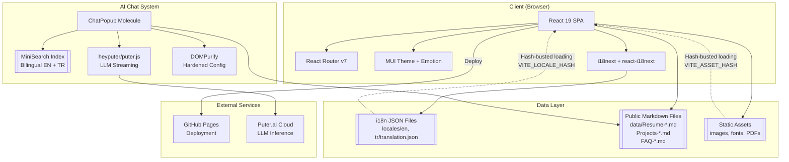

---

## 2. Component Hierarchy (Atomic Design)

```mermaid
graph TD
    App["App.tsx\nOutlet + Loading"]
    Router["router.tsx\nRoutes Config"]

    subgraph "Pages"
        HomePage["HomePage.tsx"]
        PrivacyPage["PrivacyPage.tsx"]
        ErrorPage["ErrorPage.tsx"]
    end

    subgraph "Molecules (Composite)"
        ActivityBar["ActivityBar\nNav + PersonPhoto + LangSelector + ChatBtn"]
        ChatPopup["ChatPopup\nRAG Chat Assistant"]
        StatusBar["StatusBar\nPage + Name/Title + StatusIndicator"]
        LanguageSelector["LanguageSelector\nEN/TR Toggle"]
    end

    subgraph "Atoms (Primitive)"
        ActivityButton["ActivityButton"]
        PersonPhoto["PersonPhoto"]
        ChatAssistantIcon["ChatAssistantIcon"]
        StatusIndicator["StatusIndicator"]
        CloseButton["CloseButton"]
        BoldedKeyword["BoldedKeyword"]
        AnimatedBadge["AnimatedBadge"]
        BoldedText["BoldedText"]
        ReplacePlaceholders["ReplacePlaceholders"]
    end

    subgraph "Resume Sections"
        AboutSection["AboutSection"]
        SkillsSection["SkillsSection"]
        ExperienceSection["ExperienceSection"]
        ProjectsSection["ProjectsSection"]
        EducationSection["EducationSection"]
        CertificationsSection["CertificationsSection"]
        LanguagesSection["LanguagesSection"]
        ContactSection["ContactSection"]
    end

    subgraph "Resume Items"
        SummaryContent["SummaryContent"]
        CVDownloadSection["CVDownloadSection"]
        ExperienceItem["ExperienceItem"]
        ProjectCard["ProjectCard"]
        ContactList["ContactList"]
        ContactForm["ContactForm"]
        PrivacyAccordion["PrivacyAccordion"]
        AnimatedBadgeComponent["AnimatedBadgeComponent"]
    end

    %% Relationships
    main.tsx --> App
    App --> Router
    Router --> HomePage
    Router --> PrivacyPage
    Router --> ErrorPage

    HomePage --> ActivityBar
    HomePage --> StatusBar
    HomePage --> ChatPopup
    HomePage --> Outlet

    Outlet --> AboutSection
    Outlet --> SkillsSection
    Outlet --> ExperienceSection
    Outlet --> ProjectsSection
    Outlet --> EducationSection
    Outlet --> CertificationsSection
    Outlet --> LanguagesSection
    Outlet --> ContactSection

    ActivityBar --> PersonPhoto
    ActivityBar --> ActivityButton
    ActivityBar --> LanguageSelector
    ActivityBar --> ChatAssistantIcon

    AboutSection --> SummaryContent
    AboutSection --> CVDownloadSection
    AboutSection --> AnimatedBadgeComponent
    AboutSection --> BoldedKeyword

    ExperienceSection --> ExperienceItem
    ProjectsSection --> ProjectCard
    ContactSection --> ContactList
    ContactSection --> ContactForm
    ContactSection --> PrivacyAccordion

    ChatPopup --> StatusIndicator
    ChatPopup --> CloseButton
    ChatPopup --> MarkdownRenderer["MarkdownRenderer Atom"]
    ChatPopup --> DOMPurify
```

---

## 3. Chat System - RAG Workflow (Complete Flow)

```mermaid
flowchart TD
    Start(["User Opens Chat"])

    Start --> LoadDocs["Load & Index Documents\nloadAndIndexDocuments en + tr\nPromise.all Parallel"]

    LoadDocs --> FetchResume["Fetch Resume EN + TR"]
    LoadDocs --> FetchProjects["Fetch Projects EN + TR"]
    LoadDocs --> FetchFAQ["Fetch FAQ EN + TR"]

    FetchResume --> ChunkResume["Chunk by Headings\n# ## ###"]
    FetchProjects --> ChunkProjects["Chunk by Headings\n# ## ###"]
    FetchFAQ --> ChunkFAQ["Chunk by FAQ Pattern\nQ+A pairs"]

    ChunkResume --> AddToIndex["Add to MiniSearch\nfields: title, text\nstore: title, text, source, locale"]
    ChunkProjects --> AddToIndex
    ChunkFAQ --> AddToIndex

    AddToIndex --> MergeIndex["Merge EN + TR into\nSingle Bilingual Index\nfuzzy: 0.2, title boost: 2x"]
    MergeIndex --> StoreDocs["Store Loaded Docs\nloadedDocumentsRef\nen + tr arrays"]
    StoreDocs --> Ready(["Indexing Complete\nChat Ready"])

    Ready --> UserMsg["User Sends Message"]

    UserMsg --> BuildContext["Build Initial Context\nDeveloper 1: Lazy PII Hydration\nisContactInfoQuery check"]
    BuildContext --> PIICheck{"Contact Info\nRequested?"}
    PIICheck -->|Yes| FullResume["Full Resume\nw/ Email Phone Address"]
    PIICheck -->|No| SanitizedResume["Sanitized Resume\nEMAIL REDACTED\nPHONE REDACTED\nADDRESS REDACTED"]

    FullResume --> InitialCtx["Initial Context:\nRESUME + ALL PROJECTS +\nFAQ Questions List Only"]
    SanitizedResume --> InitialCtx

    InitialCtx --> EmptyGuard{"Content\nLoaded?"}
    EmptyGuard -->|No| NoInfo["Return\nnoRelevantInformationFound"]
    EmptyGuard -->|Yes| CallLLM["Call puter.ai.chat\nStreaming + Tools"]

    CallLLM --> StreamLoop["Stream Response Loop"]
    StreamLoop --> ParseChunk["Parse Stream Chunk"]
    ParseChunk --> CheckType{"Chunk Type?"}

    CheckType -->|text| AppendText["Append to\nassistantText\nUpdate UI"]
    CheckType -->|usage| TrackUsage["Parse Usage\nprompt, completion,\ninput_cache_read"]
    CheckType -->|reasoning| DropReasoning["DROP - Prevent\nCoT Leakage"]
    CheckType -->|tool_use| CaptureTool["Capture expandSearch\nquery and searchType"]

    AppendText --> StreamLoop
    TrackUsage --> StreamLoop
    DropReasoning --> StreamLoop
    CaptureTool --> StreamLoop

    StreamLoop --> StreamEnd{"Stream\nComplete?"}
    StreamEnd -->|No| StreamLoop
    StreamEnd -->|Yes| ToolCheck{"Tool Call\nRequested?"}

    ToolCheck -->|No| PersistMsg["Persist to\napiHistoryRef\nUpdate Token Usage"]
    ToolCheck -->|Yes| ExecTool["Execute expandSearch"]

    ExecTool --> SearchType{"searchType?"}
    SearchType -->|broader| SearchFAQ["searchFAQ\nDedicated FAQ Index\nfuzzy: 0.1, boost: 3x"]
    SearchType -->|crossLocale| SearchCross["performSearch\nOther Locale Only\nfuzzy: 0.3, max: 8"]

    SearchFAQ --> FAQMatch{"FAQ\nMatched?"}
    FAQMatch -->|Yes| FAQResult["Return FAQ Q+A\nChunks"]
    FAQMatch -->|No| GeneralSearch["performSearch\nGeneral MiniSearch\nfuzzy: 0.4, max: 10"]

    SearchCross --> CrossResult["Return Cross-Locale\nResults"]

    FAQResult --> BuildExpanded["Build Expanded Context"]
    GeneralSearch --> BuildExpanded
    CrossResult --> BuildExpanded

    BuildExpanded --> CallLLM2["Second puter.ai.chat\nFollow-up with\nExpanded Context"]
    CallLLM2 --> StreamLoop2["Stream Final Response\nSame parsing logic"]
    StreamLoop2 --> PersistMsg

    PersistMsg --> CompactCheck["checkAndEnqueueCompaction\nREAL token usage:\nprompt + input_cache_read\n> 75% of 131K?"]
    CompactCheck -->|Yes| EnqueueJob["Enqueue Compaction Job\nqueueMicrotask"]
    CompactCheck -->|No| Ready

    EnqueueJob --> CompactionQueue["Compaction Queue\nSequential Processing"]
    CompactionQueue --> CompactProcess["compactHistoryWithLLM\nPrompt: Extract facts\nPreserve specifics\nNo tables, no fabrication"]
    CompactProcess --> CompactSuccess{"Success?"}
    CompactSuccess -->|Yes| UpdateHistory["apiHistoryRef =\nSummary System +\nLast 2 Turns\nReset Token Usage"]
    CompactSuccess -->|No| RetryLogic["Exponential Backoff\n1s, 2s, 4s\nMax 3 Attempts"]
    RetryLogic -->|Retry| CompactionQueue
    RetryLogic -->|Max Retries| FallbackTrunc["Fallback:\nTruncate to\nLast 2 Turns"]

    UpdateHistory --> Ready
    FallbackTrunc --> Ready

    style Start fill:#e1f5fe
    style Ready fill:#c8e6c9
    style NoInfo fill:#ffcdd2
    style DropReasoning fill:#fff3e0
    style EnqueueJob fill:#e8eaf6
    style CompactProcess fill:#e8eaf6
```

---

## 4. Background Conversation Compaction (Developer 2)

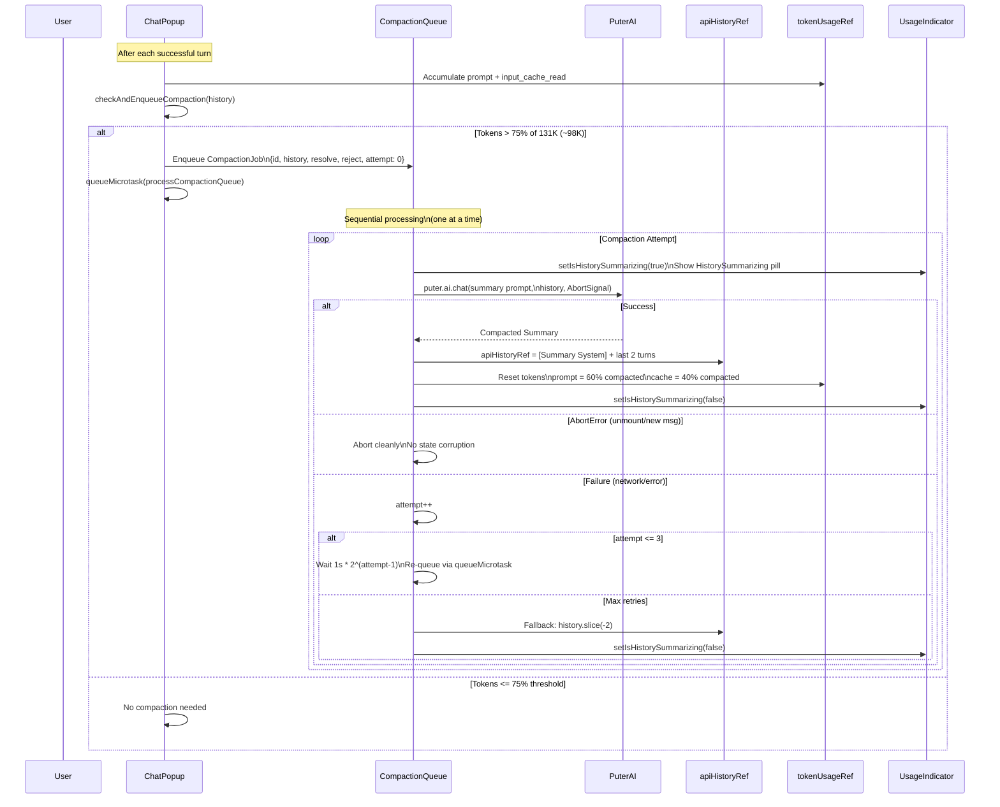

---

## 5. Document Loading & Indexing Pipeline

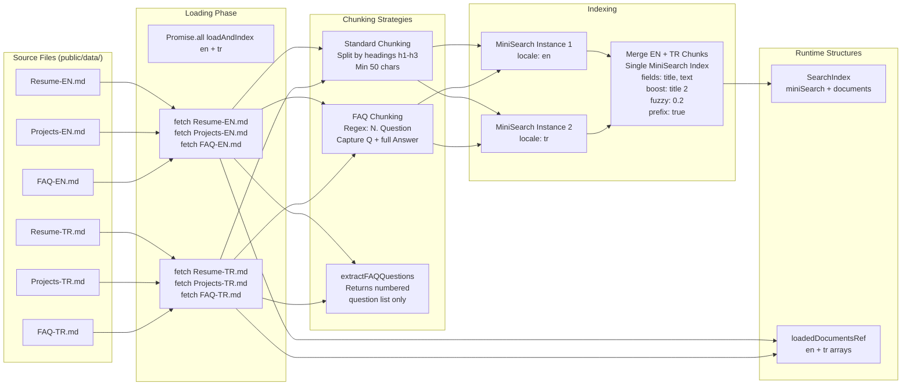

---

## 6. Resume Rendering Data Flow

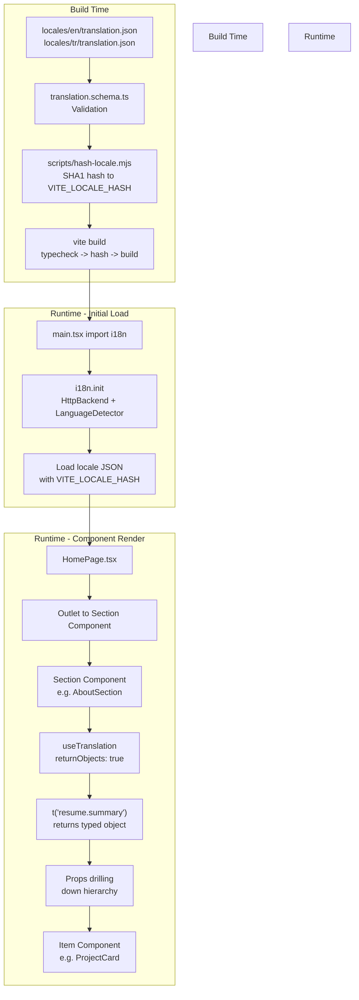

---

## 7. Routing Structure

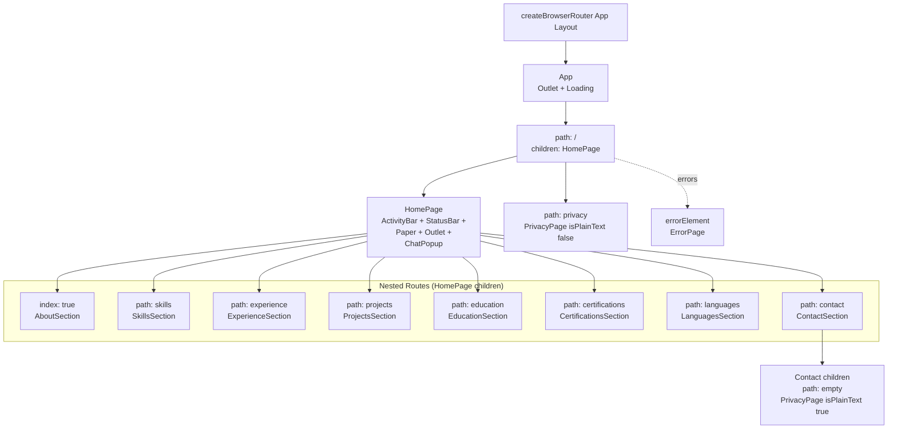

---

## 8. Chat System - ExpandSearch Tool Decision Tree

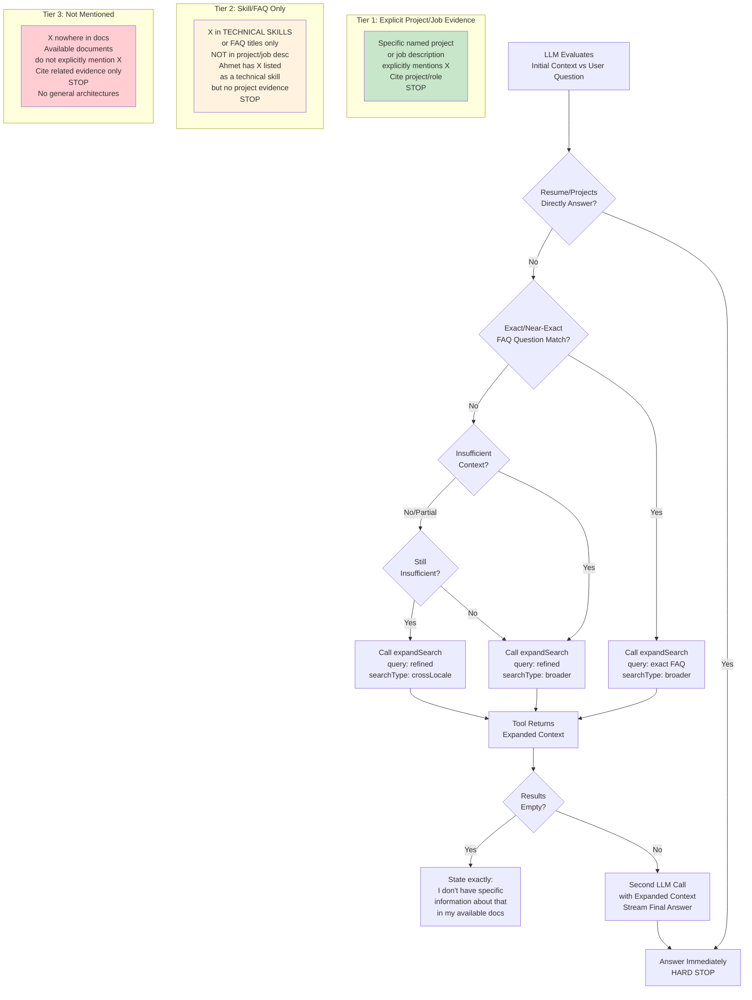

---

## 9. Token Usage Tracking & Compaction Trigger

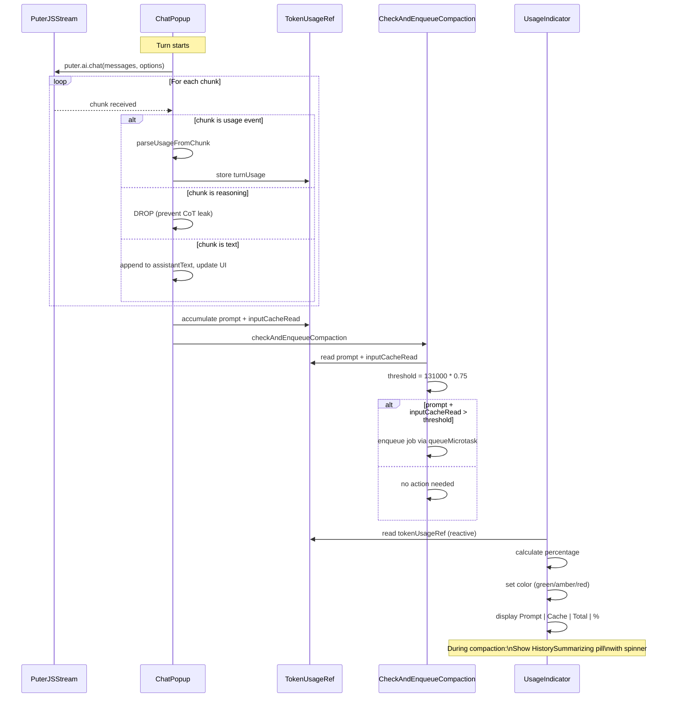

---

## 10. Internationalization Flow

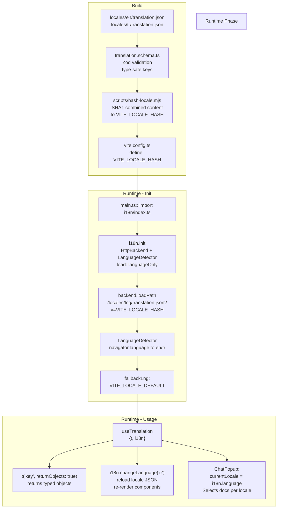

---

## 11. Security & Privacy Layers

```mermaid
graph TB
    subgraph "Input Sanitization"
        LazyPII["Lazy PII Hydration\nisContactInfoQuery check\nstripPIIFromResume"]
        FAQFilter["FAQ EXTERNAL Filter\nCommented guard in\nchunkFAQDocument"]
        ToolValidation["Tool Call Validation\nComplete tool_use only\nValidated at stream time"]
    end

    subgraph "Stream Security"
        ReasoningDrop["Reasoning Token Drop\nif part.type === reasoning\ncontinue"]
        AbortControl["AbortController\nCleanup on unmount\nwasAborted flag"]
    end

    subgraph "Output Sanitization"
        DOMPurifyConfig["DOMPurify Hardened\nALLOWED_URI_REGEXP\nFORBID_TAGS: style,iframe,form,script\nFORBID_ATTR: onerror,onload,onclick...\nADD_ATTR: target,rel"]
    end

    subgraph "Data Minimization"
        BilingualIndex["Single Bilingual Index\nNo locale mixing in\nunrelated queries"]
        CrossLocaleOnly["crossLocale searches\nONLY other locale\nNot all locales"]
        FAQOnlyList["Initial Context:\nFAQ Questions ONLY\nAnswers via expandSearch"]
    end

    UserQuery["User Message"] --> LazyPII
    UserQuery --> ToolValidation
    StreamChunks["Puter.js Stream"] --> ReasoningDrop
    StreamChunks --> AbortControl
    LLMResponse["Raw LLM Output"] --> DOMPurifyConfig
    DocumentStore["Document Sources"] --> FAQFilter
    DocumentStore --> BilingualIndex
    SearchLogic --> CrossLocaleOnly
    ContextBuild --> FAQOnlyList
```

---

## 12. Build & Deployment Pipeline

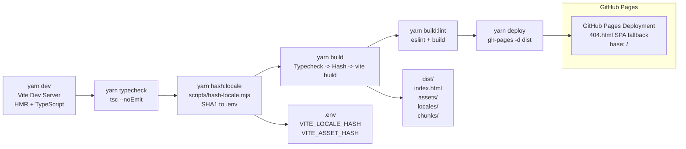

---

## 13. State Management Overview

```mermaid
graph TD
    subgraph "HomePage State"
        ChatOpen["chatOpen: boolean\ntoggleChat"]
        I18nLang["i18n.language\nfrom i18n instance"]
    end

    subgraph "ChatPopup State (Local)"
        Messages["messages: Message[]\nUI display only"]
        Draft["draft: string\ncontrolled input"]
        IsLoading["isLoading: boolean"]
        IsIndexing["isIndexing: boolean"]
        SearchIndex["searchIndex: SearchIndex | null\nMiniSearch + documents"]
        BottomRef["bottomRef: HTMLDivElement\nscroll anchor"]
        InputRef["inputRef: HTMLTextAreaElement\nfocus management"]
        ScrollContainer["scrollContainerRef: HTMLDivElement\nscroll listener"]
        AbortController["abortControllerRef: AbortController\nstream cancellation"]
        ApiHistory["apiHistoryRef: ChatMessage[]\nLLM conversation history\nEXCLUDES greeting"]
        LoadedDocs["loadedDocumentsRef: {en, tr}\nFull document content\nper locale for context"]

        subgraph "Compaction Refs (Developer 2)"
            CompQueue["compactionQueueRef: CompactionJob[]\nSequential job queue"]
            IsSummarizing["isHistorySummarizingRef: boolean\nLock for queue processing"]
            CompAbort["compactionAbortControllerRef\nAbort active compaction"]
        end

        TokenUsage["tokenUsageRef: UsageInfo\nAccumulated: prompt, completion,\ninput_cache_read, request..."]
        UserScrolled["isUserScrolledUpRef: boolean\nPause auto-scroll > 80px"]
        DraftRef["draftRef: string\nStable ref for send\nAvoids useCallback recreation"]
    end

    subgraph "Derived/UI State"
        IsSummarizingState["isHistorySummarizing: boolean\nMirror for UsageIndicator"]
        UsagePercent["getUsagePercent\n(prompt + cache) / 131k * 100"]
        UsageColor["getUsageColor\nsafe/warning/danger"]
    end

    ChatOpen --> ChatPopup
    I18nLang --> ChatPopup
    ChatPopup --> Messages
    ChatPopup --> Draft
    ChatPopup --> IsLoading
    ChatPopup --> IsIndexing
    ChatPopup --> SearchIndex
    ChatPopup --> ApiHistory
    ChatPopup --> LoadedDocs
    ChatPopup --> CompQueue
    ChatPopup --> IsSummarizing
    ChatPopup --> CompAbort
    ChatPopup --> TokenUsage
    ChatPopup --> UserScrolled
    ChatPopup --> DraftRef

    TokenUsage --> UsagePercent
    UsagePercent --> UsageColor
    IsSummarizing --> IsSummarizingState
```

---

## 14. Key Design Patterns Summary

| Pattern                 | Implementation                                     | Location                                                    |
| ----------------------- | -------------------------------------------------- | ----------------------------------------------------------- |
| **Atomic Design**       | atoms -> molecules -> components/sections -> pages | `src/atoms`, `src/molecules`, `src/components`, `src/pages` |
| **Data-Driven UI**      | i18n JSON -> useTranslation -> props drilling      | `src/i18n`, all Section/Item components                     |
| **Centralized Theming** | MUI createTheme + Emotion CacheProvider            | `src/theme/index.ts`, `main.tsx`                            |
| **Design Token Spec**   | DESIGN.md (Google Design Token Spec v1 alpha)      | `DESIGN.md` -> token references in components               |
| **Memoization**         | React.memo on presentational components            | All atoms, molecules, items, sections                       |
| **Bundle Optimization** | Direct MUI imports (`@mui/material/Button`)        | All component files                                         |
| **Asset Hashing**       | SHA1 hash -> `?v=hash` cache busting               | `scripts/hash-locale.mjs`, `vite.config.ts`                 |
| **Path Aliasing**       | `@/` -> `src/` via `vite-tsconfig-paths`           | `tsconfig.json`, `vite.config.ts`                           |
| **Error Boundaries**    | ErrorBoundary wraps RouterProvider                 | `main.tsx`, `src/components/ErrorBoundary.tsx`              |
| **Responsive Design**   | useMediaQuery(theme.breakpoints.down('md'))        | `StatusBar.tsx`, `ActivityBar.tsx`                          |
| **Accessibility**       | aria-modal, aria-label, Escape key, IME support    | `ChatPopup.tsx`, `ActivityBar.tsx`                          |

---

## 15. Chat System - Component Interaction Detail

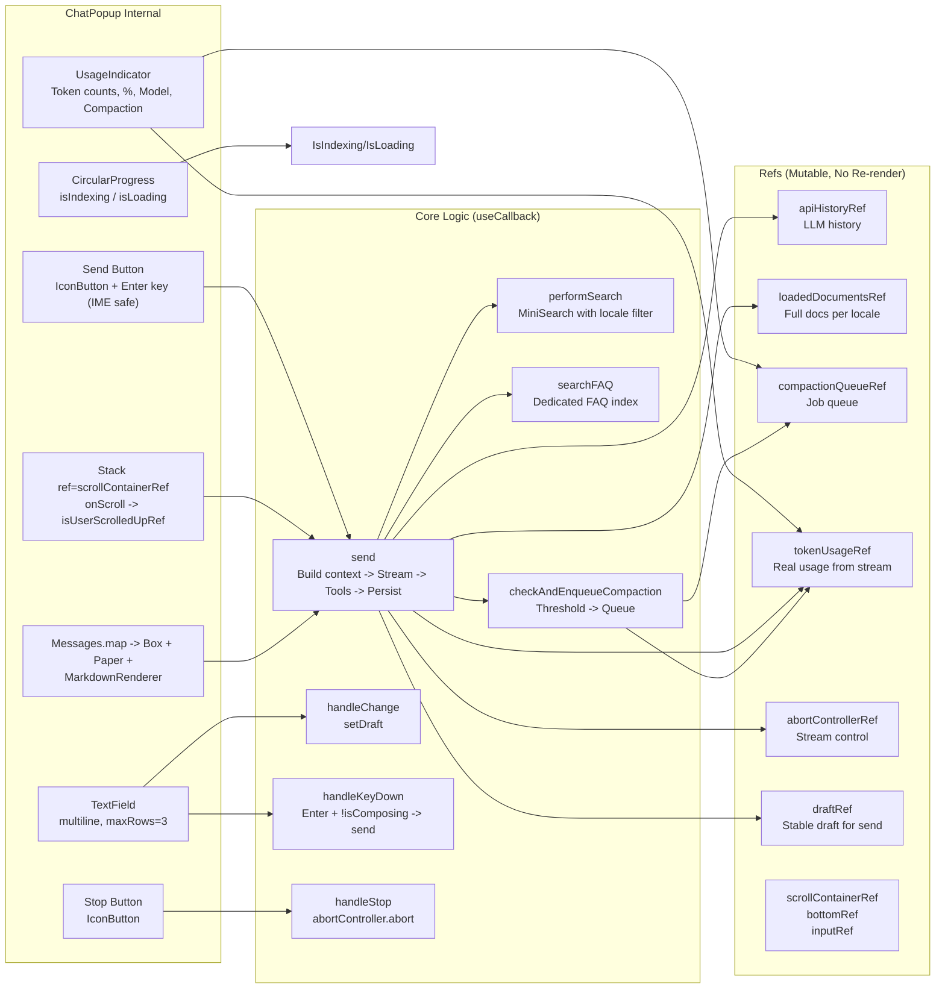
