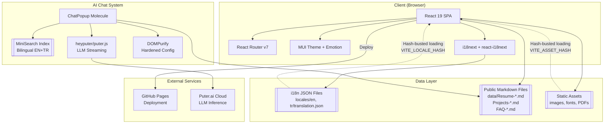
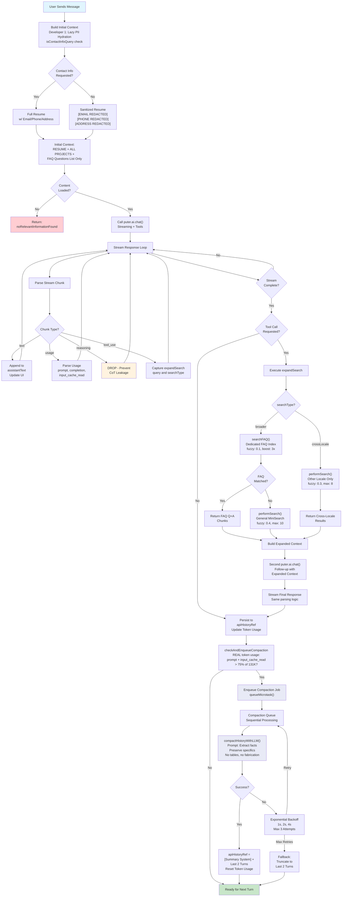

# Ahmet Fatihoglu's Personal Website

[https://ahmadmdabit.github.io](https://ahmadmdabit.github.io)

## Overview

This is a personal portfolio website for Ahmet Fatihoglu, a Senior Software Developer and Architect. The website is a dynamic, data-driven single-page application built with a modern React and TypeScript stack. It features an integrated AI chat assistant that answers questions about Ahmet's professional background using document-based retrieval augmented generation (RAG).

## Architecture Overview

### Architecture Diagrams

The following diagrams illustrate the key architectures and data flows. For the complete set of 15 detailed diagrams including component hierarchies, RAG workflow sequences, compaction pipelines, routing structures, and security layers, see **[ARCHITECTURE-DIAGRAMS.md](ARCHITECTURE-DIAGRAMS.md)**.

#### 1. High-Level System Architecture



#### 2. Component Hierarchy (Atomic Design)

```mermaid
graph TD
    App[App.tsx\nOutlet + Loading]
    Router[router.tsx\nRoutes Config]

    subgraph "Pages"
        HomePage[HomePage.tsx]
        PrivacyPage[PrivacyPage.tsx]
        ErrorPage[ErrorPage.tsx]
    end

    subgraph "Molecules (Composite)"
        ActivityBar[ActivityBar\nNav + PersonPhoto + LangSelector + ChatBtn]
        ChatPopup[ChatPopup\nRAG Chat Assistant]
        StatusBar[StatusBar\nPage + Name/Title + StatusIndicator]
        LanguageSelector[LanguageSelector\nEN/TR Toggle]
    end

    subgraph "Atoms (Primitive)"
        ActivityButton[ActivityButton]
        PersonPhoto[PersonPhoto]
        ChatAssistantIcon[ChatAssistantIcon]
        StatusIndicator[StatusIndicator]
        CloseButton[CloseButton]
        BoldedKeyword[BoldedKeyword]
        AnimatedBadge[AnimatedBadge]
        BoldedText[BoldedText]
        ReplacePlaceholders[ReplacePlaceholders]
    end

    subgraph "Resume Sections"
        AboutSection[AboutSection]
        SkillsSection[SkillsSection]
        ExperienceSection[ExperienceSection]
        ProjectsSection[ProjectsSection]
        EducationSection[EducationSection]
        CertificationsSection[CertificationsSection]
        LanguagesSection[LanguagesSection]
        ContactSection[ContactSection]
    end

    subgraph "Resume Items"
        SummaryContent[SummaryContent]
        CVDownloadSection[CVDownloadSection]
        ExperienceItem[ExperienceItem]
        ProjectCard[ProjectCard]
        ContactList[ContactList]
        ContactForm[ContactForm]
        PrivacyAccordion[PrivacyAccordion]
        AnimatedBadgeComponent[AnimatedBadgeComponent]
    end

    %% Relationships
    main.tsx --> App
    App --> Router
    Router --> HomePage
    Router --> PrivacyPage
    Router --> ErrorPage

    HomePage --> ActivityBar
    HomePage --> StatusBar
    HomePage --> ChatPopup
    HomePage --> Outlet

    Outlet --> AboutSection
    Outlet --> SkillsSection
    Outlet --> ExperienceSection
    Outlet --> ProjectsSection
    Outlet --> EducationSection
    Outlet --> CertificationsSection
    Outlet --> LanguagesSection
    Outlet --> ContactSection

    ActivityBar --> PersonPhoto
    ActivityBar --> ActivityButton
    ActivityBar --> LanguageSelector
    ActivityBar --> ChatAssistantIcon

    AboutSection --> SummaryContent
    AboutSection --> CVDownloadSection
    AboutSection --> AnimatedBadgeComponent
    AboutSection --> BoldedKeyword

    ExperienceSection --> ExperienceItem
    ProjectsSection --> ProjectCard
    ContactSection --> ContactList
    ContactSection --> ContactForm
    ContactSection --> PrivacyAccordion

    ChatPopup --> StatusIndicator
    ChatPopup --> CloseButton
    ChatPopup --> MarkdownRenderer[MarkdownRenderer Atom]
    ChatPopup --> DOMPurify
```



#### 3. Chat System - RAG Workflow (Query Flow & Tools)



### Technology Stack

- **Core Framework**: React 19 with TypeScript
- **Build Tool**: Vite with `vite-tsconfig-paths` for module aliasing
- **UI Library**: Material-UI (MUI) v7 with Emotion for styling
- **Routing**: React Router v7 with nested layouts and SPA navigation
- **State Management**: Local component state managed by React Hooks (`useState`, `useCallback`, `useEffect`, `useRef`)
- **Internationalization**: `i18next` with `react-i18next` and `i18next-browser-languagedetector` (EN/TR)
- **AI Chat**: `@heyputer/puter.js` for LLM inference with streaming, tool-calling, and abort controller support
- **Document Search**: `minisearch` for full-text indexing and retrieval of resume/FAQ/project documents
- **Markdown Rendering**: `marked` with `dompurify` for safe HTML rendering of AI responses (hardened config)
- **Styling**: Custom scrollbar styling via `src/index.css` (cross-browser thin scrollbar); **Design System**: `DESIGN.md` (Google Design Token Spec v1 alpha) defining colors, typography, spacing, shapes, and component tokens with token references
- **Deployment**: GitHub Pages via `gh-pages`

### Main Modules and Responsibilities

The project follows an **Atomic Design** methodology:

- **`src/data`** — Static data files and content modules:
  - `pagesData.ts` — Page metadata and navigation configuration
  - ~~`resumeData.ts`~~ (removed; content fully centralized in i18n JSON locale files)
  - ~~`Resume_EN_*.md`~~ (removed from `src/assets/`; single-source-of-truth is now `public/data/Resume-EN.md`)
- **`src/`** — Root level: `App.tsx` (layout with Outlet + loading state), `main.tsx` (entry point with ThemeProvider), `router.tsx` (route config), `theme/index.ts` (MUI theme), `index.css` (global styles)
- **`src/types`** — TypeScript interfaces for core data structures (`ResumeData`, `Project`, `Experience`, etc.)
- **`src/atoms`** — Smallest reusable components (e.g., `ActivityButton`, `BoldedKeyword`, `StatusIndicator`, `CloseButton`). Context-unaware, no business logic.
- **`src/molecules`** — Compositions of atoms forming complex components:
  - `ActivityBar` — Navigation sidebar with `NavLink` routing
  - `ChatPopup` — AI-powered chat assistant (see [Chat System](#chat-system) below)
  - `StatusBar` — Bottom status bar showing page name and title, with responsive mobile/tablet support
- **`src/components/resume`** — Main UI components organized into:
  - `sections/` — `AboutSection`, `SkillsSection`, `ExperienceSection`, `EducationSection`, `ContactSection`, `ProjectsSection`, `CertificationsSection`
  - `items/` — `ProjectCard`, `ContactList`, `ContactForm`, `PrivacyAccordion`, `SummaryContent`, `CVDownloadSection`
- **`src/pages`** — Page components rendered via Router Outlet (`HomePage`, `PrivacyPage`, `ErrorPage`)
- **`src/i18n`** — Internationalization configuration with locale JSON files (`en/translation.json`, `tr/translation.json`), schema validation, and asset hashing for cache busting
- **`public/data`** — Markdown documents served as data sources for the AI chat:
  - `Resume-EN.md` / `Resume-TR.md` — Structured resume content
  - `Projects-EN.md` / `Projects-TR.md` — Detailed project descriptions
  - `FAQ-EN.md` / `FAQ-TR.md` — 110 interview questions with answers and alternative phrasings (10 per question)
  - `Resume-EN.pdf` / `Resume-TR.pdf` — Downloadable PDF resumes
  - `Resume-EN.txt` / `Resume-TR.txt` — Plain-text resume versions

## Data Flow

### Resume Rendering

1. All resume content is defined in i18n translation JSON files (EN/TR).
2. Components use `useTranslation` with `returnObjects: true` to fetch structured data.
3. Content flows hierarchically: `HomePage` → `Section` components → `Item` components via props.

### Chat System (RAG Workflow)

The chat assistant implements a **Retrieval Augmented Generation** workflow with production-grade reliability and advanced context management:

1. **Document Loading** — On chat open, `loadAndIndexDocuments()` fetches markdown documents for **both** locales in parallel (`Promise.all`):
   - Resume (EN + TR) — **Lazy PII hydration (Developer 1)**: PII (email, phone, address) only included when user explicitly asks for contact info; otherwise stripped before LLM context
   - Projects (EN + TR) — Split by headings (`#`, `##`, `###`)
   - FAQ with 110 questions + alternative phrasings (EN + TR) — One chunk per Q&A pair

2. **Chunking & Indexing** — Documents are chunked with locale tags and merged into a **single bilingual `MiniSearch` index** (fuzzy 0.2, prefix matching, title boost 2×). Index built once on first open, persists for session lifetime. `DocumentSources` is **immutable** (`as const`); loaded content stored in `loadedDocumentsRef` per locale — no mutation of source config.

3. **Model Configuration** — `LLMModel` and `LLMModelContextWindow` (131K tokens for gpt-oss-120b:free) defined as constants; additional models commented for easy switching (Claude Haiku 4.5 200K, DeepSeek v4 Flash 1M, GLM 4.7 Flash 128K).

4. **Query Flow**:
   - User message → Full resume + projects content for **current locale** as initial context (empty-context guard prevents LLM call if docs failed to load)
   - FAQ content provided as **numbered question list only** (answers not inline)
   - LLM receives system prompt + document context + **full conversation history** (no arbitrary turn trimming; compaction handles context limits) via `puter.ai.chat()`
   - If initial context insufficient, LLM calls `expandSearch` tool (validated at stream time)
   - **Dedicated FAQ path**: `searchFAQ()` searches FAQ chunks only (tight fuzzy 0.1, title boost 3×) before falling back to general MiniSearch
   - `crossLocale` searches **only the other locale** (not all locales)
   - Expanded results sent back to LLM for final streaming response

5. **Background Conversation Compaction (Developer 2)** — **Non-blocking, queued compaction with exponential backoff**:
   - **Trigger**: Real token usage (prompt + input_cache_read from completed turns) exceeds 75% of context window (131K → ~98K tokens)
   - **Queue**: Jobs enqueued with unique ID, attempt counter, timestamp; processed sequentially via `queueMicrotask`
   - **Compaction**: LLM summarizes full history preserving all specific details (experience, projects, skills, technologies) using strict constraints (no tables, zero fabrication, vertical bulleted lists)
   - **Result**: Compact history = [Conversation Summary] + last 2 turns; token usage ref reset using heuristic split (60% prompt / 40% cache)
   - **Retry**: Up to 3 attempts with exponential backoff (1s, 2s, 4s); on failure, fallback to simple truncation (last 2 turns)
   - **UI**: `UsageIndicator` shows real-time token counts (Prompt / Cache / Total / %), model badge, and "HistorySummarizing..." spinner pill during compaction
   - **Abort**: Active compaction aborted on unmount or new user message

6. **Token Usage Tracking** — Parses `usage` events from Puter.js stream chunks (end of stream): `{ prompt, completion, input_cache_read }`. Accumulated per turn; drives compaction threshold and usage indicator display.

7. **Streaming & Rendering** — Responses stream in real-time with abort controller support. `MarkdownRenderer` uses hardened `DOMPurify` (forbids `javascript:` URIs, dangerous tags/attributes, allows `target`/`rel`).

8. **Session Persistence** — Messages + API history persist across popup close/reopen and locale changes. API history **excludes initial greeting** to prevent language bias. Full page refresh clears session.

9. **System Prompt Rewrite** — Strict constraints: Language Lock (respond in current message's language only), Zero Fabrication, No Tables, Conciseness. Tool Use & FAQ Protocol (Sufficient/FAQ Match/Insufficient/Empty Result). Capability & Evidence Discipline (explicit docs only, skill ≠ evidence). Meta-Request & Formatting Handling.

10. **Accessibility & UX**:
    - Modal dialog with `aria-modal="true"`, `aria-hidden={!open}`, Escape-to-close
    - Input disabled while closed; **send button** (IconButton) alongside Enter-to-send
    - IME composition support (won't send on Enter during composition)
    - Auto-scroll to bottom (`behavior: "auto"`), pauses when user scrolls up
    - Loading/indexing indicators

11. **Security & Privacy**:
    - **Lazy PII hydration**: Contact info only injected when explicitly requested
    - DOMPurify hardened config blocks XSS vectors
    - Tool call validation prevents malformed/partial stream chunks from crashing UI
    - Real token usage from provider — no heuristic estimation for compaction trigger

## Key Technical Achievements

The codebase has been systematically engineered to deliver a production-grade, secure, and context-aware system. Below are the key engineering achievements validated in the latest releases:

| Achievement Area                     | Technical Implementation & Solution                                                                                                                                                                        | Impact & Verification                                                                                                       |
| :----------------------------------- | :--------------------------------------------------------------------------------------------------------------------------------------------------------------------------------------------------------- | :-------------------------------------------------------------------------------------------------------------------------- |
| **Deterministic Context Compaction** | Built a non-blocking queue system (`queueMicrotask`) executing background history compaction via LLM summarizing. Triggers at 75% of the 131K context window. Includes exponential backoff retry policies. | Eliminates token overflows and preserves exact, high-fidelity professional state without arbitrary turn-truncation.         |
| **Bilingual RAG Workflow**           | Implemented a single, unified `MiniSearch` index containing both English and Turkish documentation. Integrated a dual-mode `expandSearch` tool to trigger targeted FAQ or cross-locale search pipelines.   | Enables instant, low-latency document and FAQ retrieval with seamless mid-conversation bilingual switching.                 |
| **3-Tier Capability Validation**     | Built a strict, structured logic chain: **Tier 1** (Project/Job Experience), **Tier 2** (Technical Skills list only), and **Tier 3** (Not Mentioned fallback) to handle all capability questions.          | Eliminates LLM overclaiming and context-bleed, forcing verifiable project evidence mapping and preventing hallucinations.   |
| **Real-time Telemetry Tracking**     | Intercepts native Puter.js stream chunks to parse actual provider-reported usages (`prompt`, `completion`, `input_cache_read`) directly in the client state.                                               | Replaces inaccurate heuristic token estimates with absolute, real-time context telemetry on a dynamic visual dashboard.     |
| **Privacy-First Data Isolation**     | Engineered a lazy PII hydration system that programmatically sanitizes all email, phone, and address footprints from RAG sources. Hydrates PII only on explicit contact requests.                          | Minimizes LLM exposure to sensitive PII and reduces the footprint size sent over third-party APIs.                          |
| **Stream Filtering & Security**      | Configured reactive chunk interceptors to strip raw `type: "reasoning"` tokens from streamed outputs. Hardened `DOMPurify` HTML rendering to block nested XSS vectors.                                     | Protects internal Chain-of-Thought (CoT) logic from leaking to the client interface and secures dynamic markdown rendering. |
| **Google Design Token Spec**         | Created a centralized, terminal-inspired design spec (`DESIGN.md` v1 alpha) with a strictly mapped custom MUI palette and Cascadia Code monospace grid system.                                             | Decouples presentational styles from semantic layout variables, ensuring robust cross-browser responsive rendering.         |

## Design Patterns and Best Practices

- **Data-Driven UI**: Resume content is dynamically generated from centralized i18n translation files, making updates easy and consistent across languages.
- **Atomic Design**: Components organized by complexity, promoting reusability and maintainability.
- **Centralized Theming**: All styling values managed through MUI theme in `App.tsx`.
- **Design System**: `DESIGN.md` (Google Design Token Spec v1 alpha) — single source of truth for colors, typography, spacing, rounded corners, and component tokens. All component definitions use token references (`{colors.primary}`, `{typography.body-md}`) instead of literal values. Defines usage indicator, usage bar, compaction indicator, and model badge component specs with safe/warning/danger semantic color coding.
- **Performance Optimization**:
  - **Memoization**: Presentational components wrapped in `React.memo`
  - **Bundle Size**: Direct-path MUI imports for optimal tree-shaking
  - **Asset Hashing**: Locale and public asset hashes (`VITE_LOCALE_HASH`, `VITE_ASSET_HASH`) for cache invalidation
- **Path Aliasing**: `@/` alias for absolute imports throughout the codebase.
- **Internationalization**: Full EN/TR support with browser language auto-detected locale, hash-busted locale loading, and **bilingual chat index** (both locales indexed in a single `MiniSearch` instance for seamless mid-conversation language switching). Translation schema validation via `translation.schema.ts`.
- **Responsive Design**: StatusBar uses `useMediaQuery` to hide page indicators on mobile/tablet.
- **Accessibility**: Chat popup includes `role="dialog"`, `aria-label`, and keyboard navigation support.
- **Security**: AI responses sanitized via `DOMPurify` before rendering; `EXTERNAL`-tagged FAQ entries (placeholders for answers not presented in the resume document) are indexed but can be filtered out via the commented-out guard in `chunkFAQDocument`; `extractFAQQuestions()` safely parses only question titles without exposing answer content in the initial prompt.
- **Centralized Theming**: All styling values managed through MUI theme in `src/theme/index.ts` and applied via `ThemeProvider` in `main.tsx`.

## Key Recent Changes

| Date       | Change                      | Description                                                                                                                                                                                                                                                                                                                                                                                                                                                                                                                                                                                                                                                                                                                                                                                                                                                                                                                                                                                                                                                                                                                                                                                                                                                                                                                                                                                                                                                                                                                                                                                                                                                                                                                                                                                                                                                                                                                                                                                                                 |
| ---------- | --------------------------- | --------------------------------------------------------------------------------------------------------------------------------------------------------------------------------------------------------------------------------------------------------------------------------------------------------------------------------------------------------------------------------------------------------------------------------------------------------------------------------------------------------------------------------------------------------------------------------------------------------------------------------------------------------------------------------------------------------------------------------------------------------------------------------------------------------------------------------------------------------------------------------------------------------------------------------------------------------------------------------------------------------------------------------------------------------------------------------------------------------------------------------------------------------------------------------------------------------------------------------------------------------------------------------------------------------------------------------------------------------------------------------------------------------------------------------------------------------------------------------------------------------------------------------------------------------------------------------------------------------------------------------------------------------------------------------------------------------------------------------------------------------------------------------------------------------------------------------------------------------------------------------------------------------------------------------------------------------------------------------------------------------------------------- |
| 2025-06-12 | **Decompose ChatPopup**     | **Architectural Modularization**: Decoupled the monolithic `ChatPopup` molecular node by refactoring its structural sub-systems into dedicated presentational elements (`MarkdownRenderer` and `ChatUsageIndicator`) under `src/atoms/`. **Strict Type Separation**: Consolidated all internal chat, search-indexing, and background compaction type boundaries into `src/types/Chat.types.ts`, and moved global third-party module overrides into `src/puter.d.ts` to keep business logic folders pristine.                                                                                                                                                                                                                                                                                                                                                                                                                                                                                                                                                                                                                                                                                                                                                                                                                                                                                                                                                                                                                                                                                                                                                                                                                                                                                                                                                                                                                                                                                                                |
| 2026-06-11 | **Design System & Chat v2** | **Major Feature Release & Security Hardening**: Added `DESIGN.md` (Google Design Token Spec v1 alpha) with a terminal-inspired theme. **ChatPopup v2**: Implemented queued background conversation compaction (75% trigger) with real-time stream token tracking (prompt/completion/cache) and lazy PII hydration. **Evidence Discipline & Anti-Fabrication**: Hardened system prompts with a strict 3-Tier Capability Discipline Framework, forcing explicit project tracing (Tier 1), skill isolation (Tier 2), and non-documented fallbacks (Tier 3). Resolved Flutter/Dart mobile mapping omissions and WPF desktop framework classification errors. **Telemetry & Security**: Intercepted stream chunks to drop reasoning tokens (`type: "reasoning"`) preventing client-side CoT leakage; hardened `DOMPurify` HTML rendering. Optimized combined procedural command overrides within the conciseness loop. **UI additions**: Added UsageIndicator with real-time token counts (Prompt/Cache/Total/%), model badge, and "HistorySummarizing..." spinner pill. **i18n**: Added EN/TR keys: `historySummarizing`, `aIMayMakeMistakes`, `usage.{prompt,cache,total,percent}`. **Theme additions**: Added warning color (#ad8837). **Removed behavior**: Removed arbitrary 20-turn history trim; compaction now handles context limits. **Ecosystem Modernization**: Upgraded the core development toolchain to Vite 8 (using native tsconfig resolution), ESLint 10, TypeScript 6, and i18next 26. Pruned legacy animation dependencies (Framer Motion, React Awesome Reveal). **W3C ARIA Compliance**: Fixed "aria-hidden on focused element" warnings by programmatically blurring the CloseButton on active click events. **UI & Privacy Refinements**: Anchored and expanded the ChatPopup viewport height (91.5vh), refactored helper disclaimers into a unified bullet list, and introduced a third-party AI data privacy warning. Hardened system instructions to forbid printing the literal string "HARD STOP". |
| 2026-06-10 | **ChatPopup Reliability**   | Fixed abort handling (empty assistant message persisted in history causing Puter.js `bad_request` on next send; abort controller cleanup on unmount; wasAborted flag in both stream loops; partial assistant bubble removed from UI on stop). Smart auto-scroll: pauses when user scrolls >80px from bottom, resumes on new message send, uses `behavior: "auto"` instead of `instant`. Callback stability: `draftRef` eliminates `draft` from `send()`'s `useCallback` deps, preventing recreation on every keystroke. Added `sendMessage` i18n key + Send button.                                                                                                                                                                                                                                                                                                                                                                                                                                                                                                                                                                                                                                                                                                                                                                                                                                                                                                                                                                                                                                                                                                                                                                                                                                                                                                                                                                                                                                                         |
| 2026-06-09 | **ChatPopup Strengthening** | Restored StatusIndicator and page name to the StatusBar. Fixed 21 critical/security/accessibility issues in `ChatPopup.tsx`: empty-context guard, history trimming (20 turns), DOMPurify strengthening, immutable DocumentSources, dedicated FAQ search path, IME composition fix, aria-modal/aria-hidden, greeting removal from API history, scrollIntoView behavior, TypeScript ref fix, robust FAQ regex, ### heading support, removed unnecessary useCallback, Send button, PII redaction, crossLocale=other-locale only, Escape key, AbortSignal passthrough                                                                                                                                                                                                                                                                                                                                                                                                                                                                                                                                                                                                                                                                                                                                                                                                                                                                                                                                                                                                                                                                                                                                                                                                                                                                                                                                                                                                                                                           |
| 2026-06-05 | **UI Fixes**                | Removed StatusIndicator from StatusBar; removed page name from StatusBar on mobile/tablet via `useMediaQuery`                                                                                                                                                                                                                                                                                                                                                                                                                                                                                                                                                                                                                                                                                                                                                                                                                                                                                                                                                                                                                                                                                                                                                                                                                                                                                                                                                                                                                                                                                                                                                                                                                                                                                                                                                                                                                                                                                                               |
| 2026-04-24 | **Resume Update**           | Added Distributed File Fragmentor project (.NET 9, Clean Architecture, CQRS, EF Core 9); removed E-Store project to keep portfolio focused                                                                                                                                                                                                                                                                                                                                                                                                                                                                                                                                                                                                                                                                                                                                                                                                                                                                                                                                                                                                                                                                                                                                                                                                                                                                                                                                                                                                                                                                                                                                                                                                                                                                                                                                                                                                                                                                                  |
| 2025-12-12 | **Resume Update**           | Added SystemProcesses project (.NET, WPF, MVVM) to translation files                                                                                                                                                                                                                                                                                                                                                                                                                                                                                                                                                                                                                                                                                                                                                                                                                                                                                                                                                                                                                                                                                                                                                                                                                                                                                                                                                                                                                                                                                                                                                                                                                                                                                                                                                                                                                                                                                                                                                        |
| 2025-10-21 | **Resume Update**           | Added Aided (SolidJS-inspired JS library) and Meeting System (.NET 9, Angular 20+, Docker) projects; refreshed skills list; removed older Sinav Oluşturma project                                                                                                                                                                                                                                                                                                                                                                                                                                                                                                                                                                                                                                                                                                                                                                                                                                                                                                                                                                                                                                                                                                                                                                                                                                                                                                                                                                                                                                                                                                                                                                                                                                                                                                                                                                                                                                                           |
| 2025-09-30 | **Resume & Error Boundary** | Updated resume content with new Architect title and skill reorganization; added Exchange and Market projects; added phone number to contact info; added `ErrorBoundary` component for graceful error handling; bumped package version to 1.0.0                                                                                                                                                                                                                                                                                                                                                                                                                                                                                                                                                                                                                                                                                                                                                                                                                                                                                                                                                                                                                                                                                                                                                                                                                                                                                                                                                                                                                                                                                                                                                                                                                                                                                                                                                                              |
| 2025-09-19 | **Deployment Fixes**        | Added `404.html` for GitHub Pages SPA fallback; set `base: '/'` and `sourcemap: false` in Vite config; moved `ThemeProvider` and `CssBaseline` to `main.tsx`; enhanced `PrivacyPage` layout                                                                                                                                                                                                                                                                                                                                                                                                                                                                                                                                                                                                                                                                                                                                                                                                                                                                                                                                                                                                                                                                                                                                                                                                                                                                                                                                                                                                                                                                                                                                                                                                                                                                                                                                                                                                                                 |
| 2025-09-18 | **AI Chat Integration**     | `ChatPopup.tsx` completely rewritten with Puter.js LLM streaming, MiniSearch bilingual merged index (both locales in single index), FAQ question list with expandSearch-on-demand, markdown rendering via `marked` + `DOMPurify`, abort controls, and session persistence across locale changes                                                                                                                                                                                                                                                                                                                                                                                                                                                                                                                                                                                                                                                                                                                                                                                                                                                                                                                                                                                                                                                                                                                                                                                                                                                                                                                                                                                                                                                                                                                                                                                                                                                                                                                             |
| 2025-09-18 | **i18n & Routing**          | Migrated from state-based navigation to declarative React Router v7 routes; resume sections now fetch data directly from i18n translations via `returnObjects: true`; standardized env vars (`VITE_ASSET_HASH`, `VITE_LOCALE_HASH`)                                                                                                                                                                                                                                                                                                                                                                                                                                                                                                                                                                                                                                                                                                                                                                                                                                                                                                                                                                                                                                                                                                                                                                                                                                                                                                                                                                                                                                                                                                                                                                                                                                                                                                                                                                                         |
| 2025-09-18 | **Component Refactoring**   | Extracted AboutSection into `SummaryContent`, `AnimatedBadgeComponent`, `CVDownloadSection`; extracted ContactSection into `ContactList`, `ContactForm`, `PrivacyAccordion`; reduced AboutSection from ~180 to ~60 lines and ContactSection from ~185 to ~20 lines                                                                                                                                                                                                                                                                                                                                                                                                                                                                                                                                                                                                                                                                                                                                                                                                                                                                                                                                                                                                                                                                                                                                                                                                                                                                                                                                                                                                                                                                                                                                                                                                                                                                                                                                                          |
| 2025-09-17 | **Asset Hashing**           | Added `scripts/hash-locale.mjs` using SHA1 for combined locale + public asset hashes; dynamic `?v=hash` cache busting for images, PDFs, favicons, and locale JSON files                                                                                                                                                                                                                                                                                                                                                                                                                                                                                                                                                                                                                                                                                                                                                                                                                                                                                                                                                                                                                                                                                                                                                                                                                                                                                                                                                                                                                                                                                                                                                                                                                                                                                                                                                                                                                                                     |
| 2025-09-17 | **Certification Badge**     | Added Microsoft certification badge to AboutSection with i18n support; extended i18n schema                                                                                                                                                                                                                                                                                                                                                                                                                                                                                                                                                                                                                                                                                                                                                                                                                                                                                                                                                                                                                                                                                                                                                                                                                                                                                                                                                                                                                                                                                                                                                                                                                                                                                                                                                                                                                                                                                                                                 |
| 2025-09-16 | **Project Scaffold**        | Initial React + Vite + TypeScript setup; Atomic Design component structure; i18n with EN/TR support; resume sections (About, Skills, Experience, Education, Contact, Certifications, Languages); ActivityBar navigation; StatusBar; ChatPopup placeholder; public assets (images, favicons, PDFs)                                                                                                                                                                                                                                                                                                                                                                                                                                                                                                                                                                                                                                                                                                                                                                                                                                                                                                                                                                                                                                                                                                                                                                                                                                                                                                                                                                                                                                                                                                                                                                                                                                                                                                                           |

## Build & Deployment

```bash
# Development
yarn dev

# Type checking
yarn typecheck

# Lint + Fix
yarn lint:fix

# Build (typecheck → hash locales → vite build)
yarn build

# Lint + build
yarn build:lint

# Deploy to GitHub Pages
yarn deploy    # runs predeploy (build:lint) then gh-pages -d dist
```

## License

This project's all rights reserved — see the [LICENSE](LICENSE.txt) file for details.
